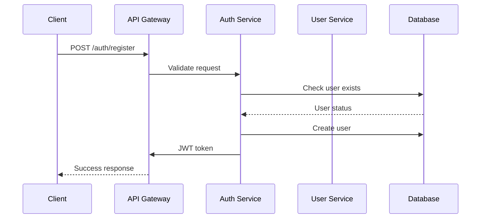
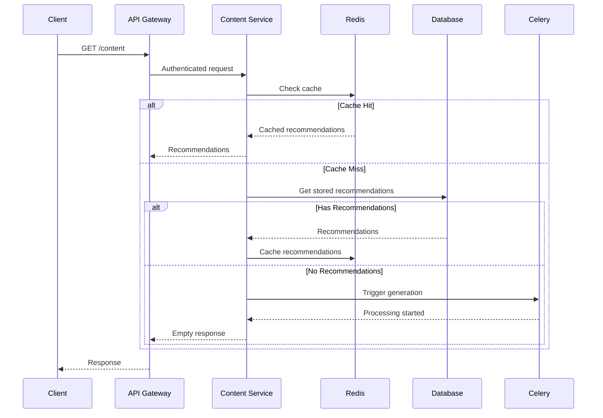
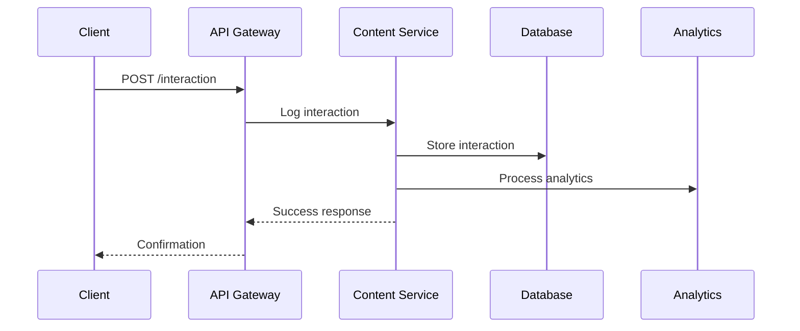

# StuckAI for Travel - System Architecture

This document provides a comprehensive overview of the StuckAI for Travel content recommendation system architecture, including design decisions, data flow, and technical implementation details.

## 🏗️ System Overview

StuckAI for Travel is a microservices-based content recommendation system designed to provide personalized recommendations for music, movies, events, and places. The system leverages modern technologies to deliver fast, scalable, and intelligent recommendations.

## 🎯 Design Principles

### 1. **Scalability First**
- Horizontal scaling capabilities
- Stateless service design
- Caching at multiple levels
- Asynchronous processing

### 2. **Performance Optimization**
- Redis caching for fast retrieval
- Database query optimization
- Connection pooling
- CDN-ready architecture

### 3. **Reliability & Fault Tolerance**
- Automatic retry mechanisms
- Circuit breaker patterns
- Graceful degradation
- Comprehensive error handling

### 4. **Security & Privacy**
- JWT-based authentication
- Data encryption at rest and in transit
- Rate limiting and DDoS protection
- GDPR compliance

## 🏛️ Architecture Components

### 1. **API Gateway Layer**

```
┌─────────────────────────────────────────────────────────────┐
│                    FastAPI API Gateway                      │
├─────────────────────────────────────────────────────────────┤
│  • Authentication & Authorization                          │
│  • Request Validation & Routing                            │
│  • Rate Limiting & Security                                │
│  • Response Formatting & CORS                              │
│  • Load Balancing (Future)                                 │
└─────────────────────────────────────────────────────────────┘
```

**Responsibilities:**
- **Authentication**: JWT token validation and user context extraction
- **Request Routing**: Route requests to appropriate services
- **Validation**: Input validation and sanitization
- **Security**: Rate limiting, CORS, and security headers
- **Monitoring**: Request logging and metrics collection

### 2. **Service Layer**

```
┌─────────────────┐  ┌─────────────────┐  ┌─────────────────┐
│ Content Service │  │  User Service   │  │  Auth Service   │
│                 │  │                 │  │                 │
│ • Recommendations│  │ • Profile Mgmt  │  │ • JWT Auth      │
│ • Interactions  │  │ • Preferences   │  │ • User Mgmt     │
│ • Caching       │  │ • Analytics     │  │ • Permissions   │
│ • Ranking       │  │ • History       │  │ • Security      │
└─────────────────┘  └─────────────────┘  └─────────────────┘
```

**Content Service:**
- Recommendation generation and retrieval
- User interaction tracking
- Content ranking and filtering
- Cache management

**User Service:**
- User profile management
- Preference tracking
- Analytics and insights
- History management

**Auth Service:**
- JWT token generation and validation
- User registration and login
- Permission management
- Security enforcement

### 3. **Data Layer**

```
┌─────────────────┐  ┌─────────────────┐  ┌─────────────────┐
│   PostgreSQL    │  │      Redis      │  │   RabbitMQ      │
│   (Primary DB)  │  │   (Cache)       │  │  (Message Q)    │
│                 │  │                 │  │                 │
│ • User Profiles │  │ • Recommendations│  │ • Task Queue    │
│ • Content Data  │  │ • Session Data  │  │ • Event Bus     │
│ • Interactions  │  │ • Temp Storage  │  │ • Async Tasks   │
│ • Analytics     │  │ • Rate Limiting │  │ • Notifications │
└─────────────────┘  └─────────────────┘  └─────────────────┘
```

**PostgreSQL:**
- Primary data store for user profiles, content, and interactions
- ACID compliance for data integrity
- Complex queries and analytics
- Data persistence and backup

**Redis:**
- High-speed caching for recommendations
- Session management
- Rate limiting and throttling
- Temporary data storage

**RabbitMQ:**
- Message broker for asynchronous tasks
- Event-driven architecture
- Task queuing and distribution
- Reliable message delivery

### 4. **Processing Layer**

```
┌─────────────────────────────────────────────────────────────┐
│                    Celery Workers                          │
├─────────────────────────────────────────────────────────────┤
│  • Recommendation Generation                               │
│  • Content Prefetching                                     │
│  • Analytics Processing                                    │
│  • Notification Sending                                     │
│  • Data Cleanup & Maintenance                              │
└─────────────────────────────────────────────────────────────┘
```

**Responsibilities:**
- **Async Processing**: Background task execution
- **Content Generation**: LLM-based recommendation generation
- **Data Processing**: Analytics and insights generation
- **Maintenance**: Data cleanup and system maintenance

## 🔄 Data Flow

### 1. **User Registration Flow**



### 2. **Recommendation Request Flow**



### 3. **Interaction Logging Flow**



## 📊 Data Models

### 1. **User Profile Model**

```sql
CREATE TABLE user_profiles (
    id SERIAL PRIMARY KEY,
    user_id INTEGER REFERENCES users(id),
    latitude DECIMAL(10, 8),
    longitude DECIMAL(11, 8),
    location_name VARCHAR(255),
    interests JSONB DEFAULT '[]',
    keywords JSONB DEFAULT '[]',
    archetypes JSONB DEFAULT '[]',
    age_group VARCHAR(50),
    relationship_status VARCHAR(50),
    travel_history JSONB DEFAULT '[]',
    created_at TIMESTAMP DEFAULT NOW(),
    updated_at TIMESTAMP DEFAULT NOW()
);
```

**Key Features:**
- **Location Awareness**: GPS coordinates and location name
- **Interest Mapping**: JSON arrays for flexible interest storage
- **Demographics**: Age group and relationship status
- **Travel History**: JSON array of travel destinations
- **Audit Trail**: Created and updated timestamps

### 2. **Content Recommendation Model**

```sql
CREATE TABLE content_recommendations (
    id SERIAL PRIMARY KEY,
    user_id INTEGER REFERENCES users(id),
    content_type VARCHAR(50) NOT NULL,
    content_id VARCHAR(255) NOT NULL,
    title VARCHAR(255) NOT NULL,
    description TEXT,
    metadata JSONB DEFAULT '{}',
    relevance_score DECIMAL(3, 2) DEFAULT 0.0,
    ranking_position INTEGER DEFAULT 0,
    is_cached BOOLEAN DEFAULT FALSE,
    cache_key VARCHAR(255),
    created_at TIMESTAMP DEFAULT NOW(),
    expires_at TIMESTAMP
);
```

**Key Features:**
- **Content Classification**: Type-based categorization
- **Metadata Storage**: Flexible JSON storage for content details
- **Relevance Scoring**: Numerical relevance scores
- **Ranking System**: Position-based ordering
- **Cache Management**: Cache status and key tracking
- **Expiration**: Time-based content expiration

### 3. **User Interaction Model**

```sql
CREATE TABLE content_interactions (
    id SERIAL PRIMARY KEY,
    user_id INTEGER REFERENCES users(id),
    content_id INTEGER REFERENCES content_recommendations(id),
    interaction_type VARCHAR(50) NOT NULL,
    interaction_data JSONB DEFAULT '{}',
    device_info JSONB DEFAULT '{}',
    location JSONB DEFAULT '{}',
    created_at TIMESTAMP DEFAULT NOW()
);
```

**Key Features:**
- **Interaction Types**: View, click, ignore, like, etc.
- **Context Data**: Device and location information
- **Flexible Metadata**: JSON storage for interaction details
- **Temporal Tracking**: Precise interaction timestamps

## 🔧 Technical Implementation

### 1. **Caching Strategy**

**Redis Cache Keys:**
```
prefetch:{user_id}:{content_type}     # Cached recommendations
session:{user_id}                     # User session data
rate_limit:{user_id}:{endpoint}       # Rate limiting
temp:{task_id}                        # Temporary task data
```

**Cache TTL Strategy:**
- **Recommendations**: 30 minutes (configurable)
- **Session Data**: 24 hours
- **Rate Limiting**: 1 hour
- **Temporary Data**: 1 hour

### 2. **Async Task Processing**

**Celery Task Types:**
```python
@shared_task
def generate_recommendations(request_data):
    """Generate recommendations for a user"""

@shared_task
def refresh_user_recommendations(user_id):
    """Refresh all recommendations for a user"""

@shared_task
def cleanup_expired_recommendations():
    """Clean up expired recommendations"""

@shared_task
def process_interaction_analytics(interaction_data):
    """Process interaction analytics"""
```

**Task Queue Configuration:**
- **Broker**: RabbitMQ with persistent queues
- **Result Backend**: Redis for task results
- **Concurrency**: Configurable worker processes
- **Retry Policy**: Exponential backoff with max retries

### 3. **Security Implementation**

**JWT Authentication:**
```python
# Token structure
{
    "user_id": 123,
    "username": "user@example.com",
    "permissions": ["read:content", "write:interactions"],
    "exp": 1640995200,
    "iat": 1640908800
}
```

**Rate Limiting:**
- **Window**: 1 hour sliding window
- **Limits**: 1000 requests per hour per user
- **Storage**: Redis-based rate limiting
- **Headers**: X-RateLimit-* headers

### 4. **Error Handling**

**Error Response Format:**
```json
{
    "error": {
        "code": "VALIDATION_ERROR",
        "message": "Invalid input data",
        "details": {
            "field": "email",
            "issue": "Invalid email format"
        },
        "timestamp": "2024-01-01T00:00:00Z",
        "request_id": "req_123456789"
    }
}
```

**Error Categories:**
- **Validation Errors**: Input validation failures
- **Authentication Errors**: JWT and permission issues
- **Business Logic Errors**: Domain-specific errors
- **System Errors**: Infrastructure and technical errors

## 📈 Performance Considerations

### 1. **Database Optimization**

**Indexes:**
```sql
-- User profile indexes
CREATE INDEX idx_user_profiles_user_id ON user_profiles(user_id);
CREATE INDEX idx_user_profiles_location ON user_profiles(latitude, longitude);

-- Content recommendation indexes
CREATE INDEX idx_content_recs_user_type ON content_recommendations(user_id, content_type);
CREATE INDEX idx_content_recs_expires ON content_recommendations(expires_at);

-- Interaction indexes
CREATE INDEX idx_interactions_user_time ON content_interactions(user_id, created_at);
CREATE INDEX idx_interactions_type ON content_interactions(interaction_type);
```

**Query Optimization:**
- Connection pooling with SQLAlchemy
- Prepared statements for repeated queries
- Query result caching
- Pagination for large result sets

### 2. **Caching Optimization**

**Cache Hit Ratio Target:** > 80%

**Cache Warming Strategies:**
- Prefetch recommendations for active users
- Background cache population
- Intelligent cache invalidation
- Cache size monitoring

### 3. **API Performance**

**Response Time Targets:**
- **Cache Hit**: < 50ms
- **Database Hit**: < 200ms
- **Async Generation**: < 500ms (initial response)

**Optimization Techniques:**
- Response compression (gzip)
- HTTP/2 support
- Connection keep-alive
- Response streaming for large datasets

## 🔍 Monitoring & Observability

### 1. **Metrics Collection**

**Application Metrics:**
- Request rate and response times
- Error rates and types
- Cache hit/miss ratios
- Database query performance

**Business Metrics:**
- User engagement rates
- Recommendation click-through rates
- Content interaction patterns
- User satisfaction scores

### 2. **Logging Strategy**

**Log Levels:**
- **DEBUG**: Detailed debugging information
- **INFO**: General application flow
- **WARNING**: Potential issues
- **ERROR**: Error conditions
- **CRITICAL**: System failures

**Log Format:**
```json
{
    "timestamp": "2024-01-01T00:00:00Z",
    "level": "INFO",
    "service": "content-service",
    "request_id": "req_123456789",
    "user_id": 123,
    "message": "Recommendation generated successfully",
    "metadata": {
        "content_type": "music",
        "recommendation_count": 5,
        "processing_time_ms": 150
    }
}
```

### 3. **Health Checks**

**Health Check Endpoints:**
- `/health` - Basic service health
- `/health/detailed` - Detailed health with dependencies
- `/metrics` - Prometheus metrics endpoint
- `/ready` - Readiness probe for Kubernetes

## 🚀 Deployment Architecture

### 1. **Development Environment**

```
┌─────────────────┐  ┌─────────────────┐  ┌─────────────────┐
│   FastAPI       │  │   Celery        │  │   PostgreSQL    │
│   (Port 8000)   │  │   Worker        │  │   (Port 5432)   │
└─────────────────┘  └─────────────────┘  └─────────────────┘
         │                      │                      │
         └──────────────────────┼──────────────────────┘
                                │
                    ┌─────────────▼─────────────┐
                    │      Redis + RabbitMQ     │
                    │      (Port 6379/5672)     │
                    └───────────────────────────┘
```

### 2. **Production Environment**

```
┌─────────────────┐  ┌─────────────────┐  ┌─────────────────┐
│   Load Balancer │  │   CDN           │  │   Monitoring    │
│   (Nginx/ALB)   │  │   (CloudFront)  │  │   (Prometheus)  │
└─────────┬───────┘  └─────────────────┘  └─────────────────┘
          │
    ┌─────▼─────┐
    │ API Gateway│
    │ (FastAPI) │
    └─────┬─────┘
          │
    ┌─────▼─────┐
    │ Services  │
    │ (Multiple)│
    └─────┬─────┘
          │
    ┌─────▼─────┐
    │ Data Layer│
    │ (RDS/ElastiCache)│
    └───────────┘
```

### 3. **Containerization**

**Docker Configuration:**
```dockerfile
# Multi-stage build for optimization
FROM python:3.9-slim as builder
WORKDIR /app
COPY requirements.txt .
RUN pip install --user -r requirements.txt

FROM python:3.9-slim
WORKDIR /app
COPY --from=builder /root/.local /root/.local
COPY . .
CMD ["uvicorn", "app.main:app", "--host", "0.0.0.0", "--port", "8000"]
```

**Docker Compose:**
```yaml
version: '3.8'
services:
  api:
    build: .
    ports:
      - "8000:8000"
    environment:
      - DATABASE_URL=postgresql://user:pass@db:5432/db
    depends_on:
      - db
      - redis
      - rabbitmq
  
  worker:
    build: .
    command: celery -A app.tasks.celery_app worker
    depends_on:
      - db
      - redis
      - rabbitmq
  
  db:
    image: postgres:13
    environment:
      POSTGRES_DB: smart_recommender
      POSTGRES_USER: user
      POSTGRES_PASSWORD: pass
  
  redis:
    image: redis:6-alpine
  
  rabbitmq:
    image: rabbitmq:3-management
```

## 🔮 Future Enhancements

### 1. **Advanced Features**
- **Real-time Recommendations**: WebSocket-based live updates
- **A/B Testing Framework**: Experimentation platform
- **Advanced Analytics**: ML-powered insights
- **Multi-language Support**: Internationalization

### 2. **Scalability Improvements**
- **Microservices Split**: Service decomposition
- **Event Sourcing**: Event-driven architecture
- **CQRS Pattern**: Command Query Responsibility Segregation
- **GraphQL API**: Flexible data querying

### 3. **AI/ML Integration**
- **Real LLM Integration**: OpenAI, Anthropic, etc.
- **Recommendation Algorithms**: Collaborative filtering, content-based
- **Personalization Engine**: Advanced user modeling
- **Predictive Analytics**: User behavior prediction

---

This architecture document provides a comprehensive overview of the StuckAI for Travel system design. For implementation details, refer to the individual service documentation and code comments. 